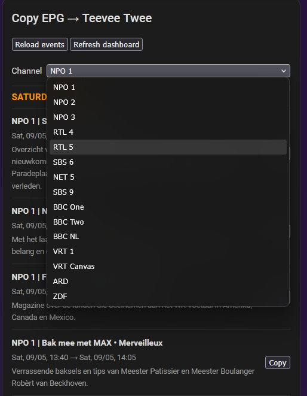
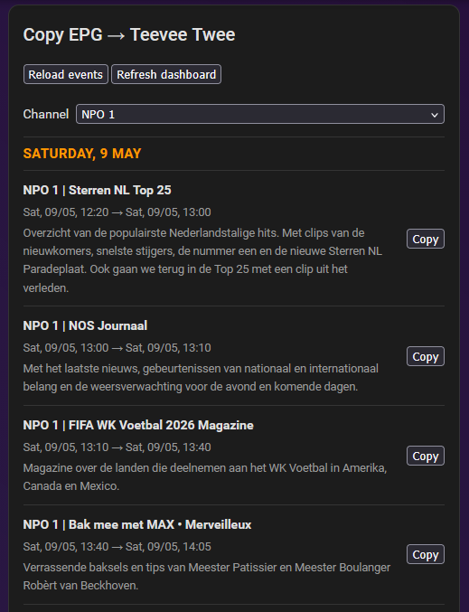
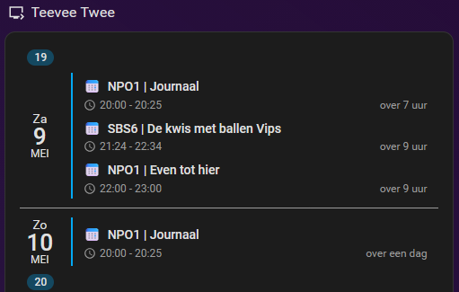
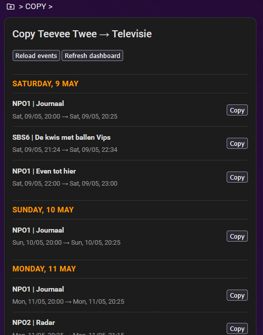
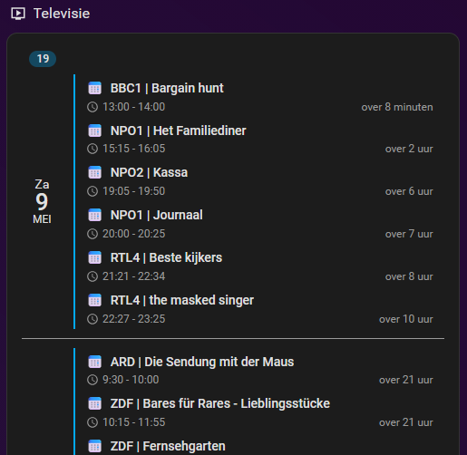
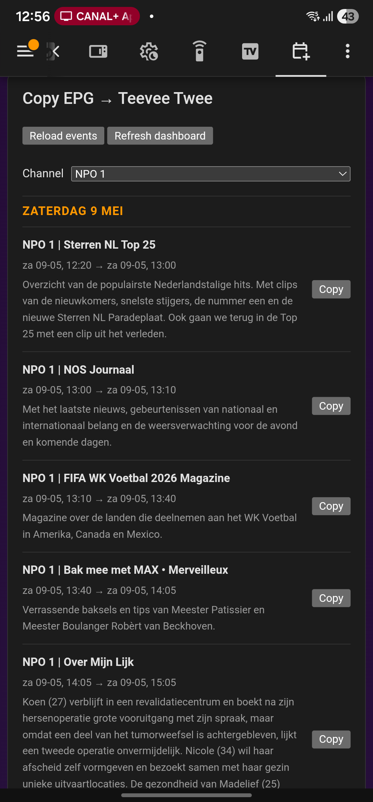

# tv-planner-card

A custom Lovelace card for Home Assistant that allows browsing TV/EPG program sources and copying selected programs into Home Assistant calendars.

The project started as a personal workflow tool for curating TV schedules from multiple EPG sources into a final “watch list” calendar, but is designed to support generic scheduling and planning workflows as well.

---

## Background

I use Home Assistant to automatically switch TV channels based on calendar events.

In practice, I use two separate calendars:

- A **staging calendar** containing programs I _might_ want to watch
- A **live viewing calendar** containing programs I definitely want to watch live

This card was created to simplify the process of browsing TV schedules and copying programs between those calendars.

The project also integrates nicely with the excellent HA-EPG integration, allowing TV schedules to be browsed directly from EPG sources and copied into Home Assistant calendars.

While my personal workflow uses two calendars, there is absolutely no requirement to do so — the card can also be used with a single planning calendar or for completely different scheduling workflows.

The automatic TV switching automation itself will eventually become a separate project.

---

## Features

- Browse Home Assistant calendar events
- Browse HA-EPG/Open-EPG program listings
- Copy selected items into Home Assistant calendars
- Group events by day
- Multi-channel EPG selection
- Channel icon support
- External channel icon JSON support
- Configurable description display modes
- Manual refresh controls
- Browser Mod dashboard refresh integration
- Lightweight frontend-only architecture
- Mobile-friendly layout
- Non-destructive copy workflow
- Localization support
- Configurable time/date formatting
- Session-based copied-event tracking
- Configurable debug logging

---

## Current Status

⚠️ Active development project

The card is already fully usable for daily workflows, but configuration options and APIs may still evolve between versions.

---

## Screenshots

### HA-EPG source browser



### HA-EPG source card



### Intermediate planning calendar



### Calendar-to-calendar copy workflow



### Final viewing calendar



### Mobile view



---

## Channel Icons

The card supports multiple channel icon lookup methods:

1. Native HA-EPG channel_icon attributes
2. Explicit channel_icons configuration
3. External JSON icon databases via channel_icons_url

### Example: explicit icon configuration

```YAML
type: custom:tv-planner-card
source_type: calendar

channel_icons:
  NPO 1: https://images.open-epg.com/8617.png
  NPO1: https://images.open-epg.com/8617.png
  SBS6: https://images.open-epg.com/8664.png
```

### Example: external JSON icon database

```YAML
type: custom:tv-planner-card
channel_icons_url: /local/channel-icons.json
```

### Example JSON

```JSON
{
  "NPO 1": "https://images.open-epg.com/8617.png",
  "NPO1": "https://images.open-epg.com/8617.png",
  "SBS6": "https://images.open-epg.com/8664.png"
}
```

The card automatically generates and matches normalized aliases such as:

- NPO 1 ↔ NPO1
- SBS6 ↔ SBS 6
- BBC NL ↔ BBCNL

---

## Description Modes

The card supports configurable description visibility.

### Always visible (default)

```YAML
description_mode: visible
```

### Completely hidden

```YAML
description_mode: hidden
```

### Expand/collapse descriptions (collapsed by default)

```YAML
description_mode: toggle-off
```

### Expand/collapse descriptions (expanded by default)

```YAML
description_mode: toggle-on
```

---

## Supported Sources

### Calendar sources

- Home Assistant calendar entities

### EPG sources

- HA-EPG entities
- Open-EPG based schedules

---

## Planned Features

- Visual card editor
- HACS support
- XMLTV support
- Additional EPG providers
- Search and filtering
- Duplicate detection
- Bulk copy operations
- Drag/drop planning
- Responsive/mobile layouts

---

## Example: Calendar → Calendar

```yaml
type: custom:tv-planner-card
title: Copy TV Schedule
source_type: calendar
source_calendar: calendar.teevee_twee
target_calendar: calendar.televisie
copy_script: script.calendar_copy_event_to_another_calendar
days_to_show: 14
```

---

## Example: HA-EPG → Calendar

```yaml
type: custom:tv-planner-card
title: Copy EPG → Teevee Twee
source_type: ha_epg
target_calendar: calendar.teevee_twee
copy_script: script.calendar_copy_event_to_another_calendar
days_to_show: 2

sources:
  - label: NPO 1
    entity: sensor.epg_npo1

  - label: NPO 2
    entity: sensor.epg_npo2

  - label: SBS6
    entity: sensor.epg_sbs6
```

---

## Configuration

| Option | Type | Description |
| ------ | ---- | ----------- |
| `title` | `string` | Card title |
| `source_type` | `calendar` \| `ha_epg` | Source provider type |
| `source_calendar` | `string` | Calendar entity used as source |
| `source_entity` | `string` | Single HA-EPG source entity |
| `sources` | `list` | Multiple selectable HA-EPG sources |
| `target_calendar` | `string` | Target calendar entity |
| `copy_script` | `string` | Script used for copying events |
| `days_to_show` | `number` | Number of days to display |
| `channel_icons` | `object` | Inline channel icon mappings |
| `channel_icons_url` | `string` | External JSON icon database |
| `description_mode` | `hidden` \| `visible` \| `toggle-on` \| `toggle-off` | Description display mode |
| `language` | `en` \| `nl` | UI language |
| `debug` | `boolean` | Enable debug logging |
| `time_display_mode` | `compact` \| `full` | Time display mode |
| `time_locale` | `string` | Locale for date/time formatting |

---

## Localization

The card supports UI translations.

Currently supported languages:

- `en`
- `nl`

Example:

```yaml
language: nl
```

---

## Time Formatting

The card supports compact and full time display modes.

### Compact mode (default)

```yaml
time_display_mode: compact
```

Example:

```text
Mon 11-05 23:45 → 00:35
```

### Full mode

```yaml
time_display_mode: full
```

Example:

```text
Mon 11-05 23:45 → Tue 12-05 00:35
```

### Locale configuration

```yaml
time_locale: nl-NL
```

Examples:

- `nl-NL`
- `en-GB`
- `en-US`
- `de-DE`

---

## Required Home Assistant Script

Example copy script:

```yaml
alias: Calendar - Copy event to another calendar
mode: single

fields:
  source_type:
    name: Source type
    required: false
    selector:
      text:

  source_calendar:
    name: Source calendar
    required: false
    selector:
      text:

  source_entity:
    name: Source entity
    required: false
    selector:
      text:

  target_calendar:
    name: Target calendar
    required: true
    selector:
      text:

  summary:
    name: Summary
    required: true
    selector:
      text:

  description:
    name: Description
    required: false
    selector:
      text:

  location:
    name: Location
    required: false
    selector:
      text:

  start_date_time:
    name: Start date/time
    required: true
    selector:
      text:

  end_date_time:
    name: End date/time
    required: true
    selector:
      text:

sequence:
  - action: calendar.create_event
    target:
      entity_id: "{{ target_calendar }}"
    data:
      summary: "{{ summary }}"
      description: >-
        {{ description | default('') }}

        Copied from:
        source_type={{ source_type | default('') }}
        source_calendar={{ source_calendar | default('') }}
        source_entity={{ source_entity | default('') }}
      location: "{{ location | default('') }}"
      start_date_time: "{{ start_date_time }}"
      end_date_time: "{{ end_date_time }}"
```

---

## Installation (manual)

1. Copy `tv-planner-card.js` to:

```text
/config/www/
```

1. Add as a dashboard resource:

```yaml
url: /local/tv-planner-card.js
type: module
```

1. Restart the Home Assistant frontend, or hard-refresh the browser.

---

## Development

Project stack:

- TypeScript
- Lit
- Vite

Build:

```Bash
npm install
npm run build
```

The generated frontend bundle is:

`dist/tv-planner-card.js`

## Debugging

Enable debug logging:

```yaml
debug: true
```

This enables additional console logging for:

- event rendering
- calendar responses
- icon resolution
- internal parsing

---

## Disclaimer

This project is not affiliated with any EPG provider or broadcaster.

---

## License

MIT
